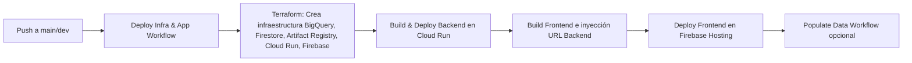

[](https://cloud.google.com)
[](https://peps.python.org/pep-0596/#schedule-first-bugfix-release)
[](https://react.dev/)
[](https://ai.google.dev/gemini-api/docs)
[](https://hub.docker.com/r/amazon/aws-lambda-python)
[](https://nodejs.org/)
[](gender_movie_classification/events/event.json)
[](https://hoppscotch.io/)


# HackDay Gemini Assistant

## 🚀 Descripción

Este proyecto implementa un **asistente multimodal** (voz + análisis visual) para un caso de uso de seguros, con backend en **Cloud Run** y frontend en **Firebase Hosting**.

Permite:

- **Detección de UI y flujo de compra**.
- **Asesoría contextual** por texto y voz.
- **Simulación dinámica de cotizaciones**.
- **Interacción gráfica en tiempo real** (tooltips, resaltar campos) mediante WebSockets.

---

## 📂 Estructura del Proyecto

```
📦 HackDayIAMindsInsuranceCarrier
├── backend/
│   ├── app/
│   │   ├── main.py
│   │   ├── db.py
│   │   └── __init__.py
│   ├── requirements.txt
│   └── Dockerfile
│
├── frontend/
│   ├── src/
│   │   ├── App.jsx
│   │   ├── index.js
│   │   └── components/
│   ├── public/
│   │   ├── index.html
│   │   ├── favicon.ico
│   │   ├── manifest.json
│   │   └── robots.txt
│   ├── package.json
│   └── .env.example
│
├── terraform/
│   ├── main.tf
│   ├── variables.tf
│   ├── outputs.tf
│   ├── gcp-key.json        # ⚠️ No subir a GitHub
│   └── README.md
│
├── data/
│   ├── generate_dummy_data.py
│   ├── load_dummy_data.py
│   ├── gemini_interactions_dummy.csv
│   └── utils/
│       └── paths.py
│
├── .github/
│   └── workflows/
│       ├── deploy-infra.yml
│       ├── deploy-app.yml
│       ├── destroy-infra.yml
│       └── populate-data.yml
│
├── .env                    # ⚠️ No subir a GitHub
├── Makefile
├── README.md
└── .gitignore
```

---

## ⚙️ Configuración Local

### 1️⃣ Clonar el repositorio

```bash
git clone https://github.com/<usuario>/<repo>.git
cd HackDayIAMindsInsuranceCarrier
```

### 2️⃣ Backend (local)

```bash
cd backend
python3 -m venv .venv
source .venv/bin/activate
pip install -r requirements.txt
uvicorn app.main:app --reload --port 8080
```

### 3️⃣ Frontend (local)

```bash
cd frontend
cp .env.example .env
npm install
npm start
```

El frontend usará la variable `REACT_APP_API_URL` definida en `.env` (`http://localhost:8080` para desarrollo).

---

## 🔑 Variables de Entorno

| Variable          | Descripción                                        |
| ----------------- | -------------------------------------------------- |
| GOOGLE\_API\_KEY  | API Key de Gemini                                  |
| GCP\_PROJECT\_ID  | ID del proyecto en GCP                             |
| BIGQUERY\_DATASET | Dataset BigQuery (por defecto `hackday_data`)      |
| BIGQUERY\_TABLE   | Tabla BigQuery (por defecto `gemini_interactions`) |

---

## ☁️ Despliegue con GitHub Actions

1. Configura **Secrets** en tu repositorio (`Settings → Secrets and variables → Actions`):

| Secret           | Valor Ejemplo                      |
| ---------------- | ---------------------------------- |
| `GCP_PROJECT_ID` | `hackday-project-1234`             |
| `GCP_SA_KEY`     | Contenido JSON del Service Account |
| `FIREBASE_TOKEN` | Token de autenticación de Firebase |

2. Los workflows se disparan automáticamente al hacer **push a main** o se pueden ejecutar manualmente.

---

## 🏗️ Comandos `make ...-actions`

| **Comando**           | **Workflow llamado**                  | **Acción en GCP**                                                      |
| --------------------- | ------------------------------------- | ---------------------------------------------------------------------- |
| make deploy-actions   | `.github/workflows/deploy-infra.yml`  | 🚀 Despliega infraestructura (Terraform) y app (Cloud Run + Firebase). |
| make populate-actions | `.github/workflows/populate-data.yml` | 📦 Pobla BigQuery y Firestore con datos dummy.                         |
| make destroy-actions  | `.github/workflows/destroy-infra.yml` | 🗑️ Elimina infraestructura, servicio Cloud Run y Firebase Hosting.    |

---

## 🔄 Flujo CI/CD



---

## 📊 Datos Dummy y Métricas

Ejecuta:

```bash
make populate-data
```

Esto genera `gemini_interactions_dummy.csv` con 100 registros y los carga a **BigQuery** y **Firestore**, listos para visualizar en **Looker Studio**:

- Distribución de productos consultados.
- Etapas más frecuentes.
- Conversiones a compra finalizada (%).
- Tendencias de interacciones en el tiempo.
- Matriz Producto vs Etapa (heatmap).

---

## 🔮 Futuras Mejoras

- Soporte para **streaming de audio** en tiempo real.
- Integración con sistemas de cotización reales.
- Optimización de prompts y caching de respuestas.
- Autenticación y control de sesiones de usuario.


--
## Autores
---
* **Hubert Ronald** - *Trabajo Inicial* - [HubertRonald / HackDayIAMindsInsuranceCarrier](https://github.com/HubertRonald/HackDayIAMindsInsuranceCarrier)

Ve también la lista de [contribuyentes](https://github.com/HubertRonald/HackDayIAMindsInsuranceCarrier/contributors) que participaron en este proyecto.


## Licencia
---
Este proyecto está bajo licencia MIT - ver la [LICENCIA](LICENSE) archivo (en inglés) con más detalles


---

👨‍💻 **HackDay 2025 IA Minds - Eremia**
