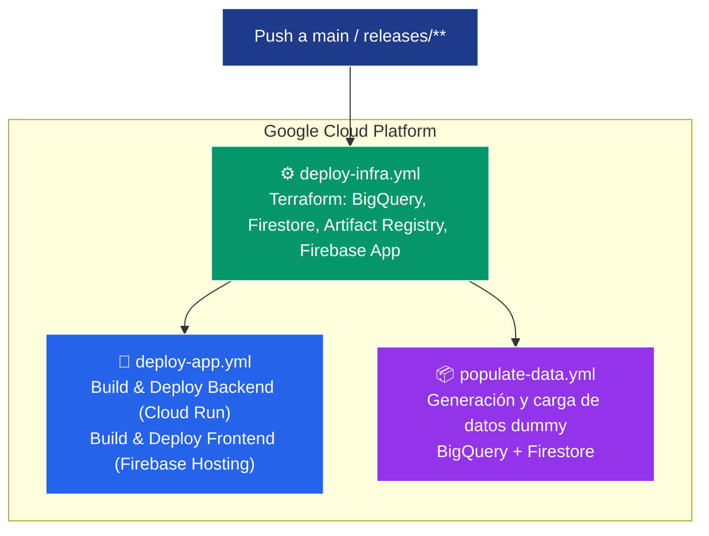
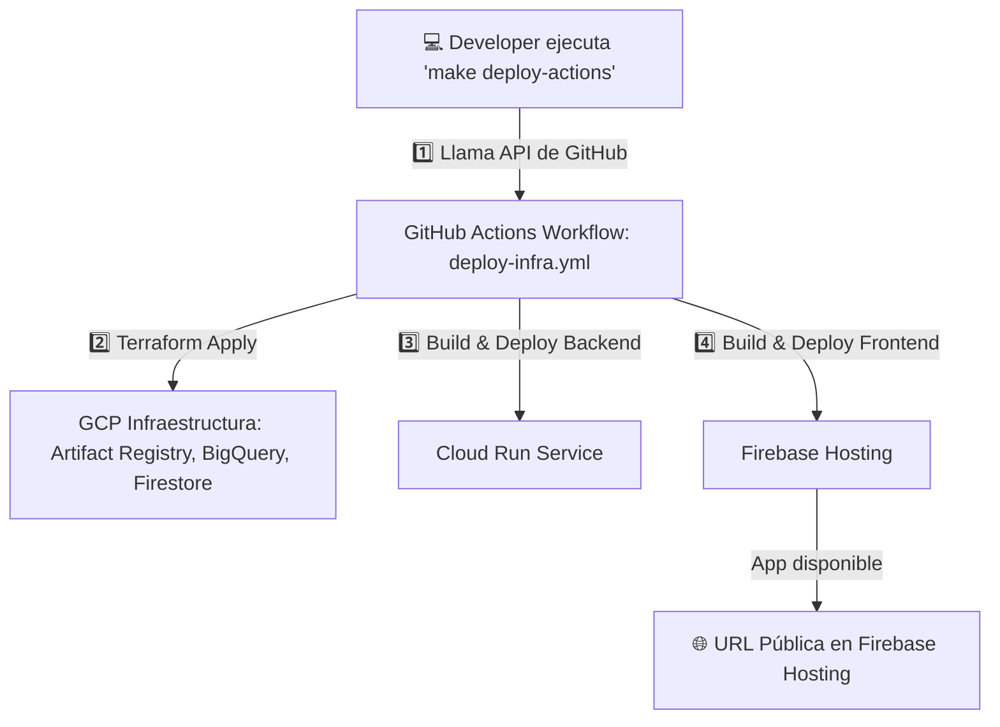

# Infraestructura HackDay Gemini Assistant

Este módulo Terraform crea:
- Artifact Registry
- Cloud Run (backend)
- Firebase Hosting (frontend)

## Despliegue manual

```bash
cd terraform
terraform init
terraform apply -auto-approve -var="project_id=MI_PROYECTO" -var="credentials_file=../gcp-key.json"
```

## Destrucción

```bash
terraform destroy -auto-approve
```

## Despliegue automático (CI/CD)
GitHub Actions ejecuta automáticamente:
1. Terraform para infraestructura.
2. Construcción de imagen y despliegue en Cloud Run.
3. Deploy frontend a Firebase Hosting.


## 🚀 Flujo de Despliegue Automático (GitHub Actions)



📌 Tabla de Comandos make ...-actions y su efecto en GCP
| **Comando Make**           | **Workflow llamado**          | **Acción ejecutada en GCP (remotamente)**                                                                 | **Cuándo usarlo**                                                                 |
|----------------------------|------------------------------|-----------------------------------------------------------------------------------------------------------|-----------------------------------------------------------------------------------|
| `make deploy-actions`      | `.github/workflows/deploy-infra.yml` | 🚀 Crea/actualiza la infraestructura con Terraform + despliega **backend (Cloud Run)** + **frontend (Firebase Hosting)** usando la rama actual. | Cuando quieres desplegar tu aplicación y la infraestructura en la nube sin correr nada localmente. Ideal para pruebas o despliegue manual. |
| `make populate-actions`    | `.github/workflows/populate-data.yml` | 📦 Genera datos dummy y los carga en **BigQuery** y **Firestore** (requiere infraestructura ya desplegada). | Después de un despliegue para poblar datos de prueba sin correr scripts locales.   |
| `make destroy-actions`     | `.github/workflows/destroy-infra.yml` | 🗑️ Elimina la infraestructura de GCP (Terraform destroy) + borra servicio de **Cloud Run** + elimina hosting en Firebase. | Cuando deseas eliminar toda la infraestructura y despliegues desde la nube sin usar tu terminal local. |


📌 Diagrama de Flujo (Mermaid)

