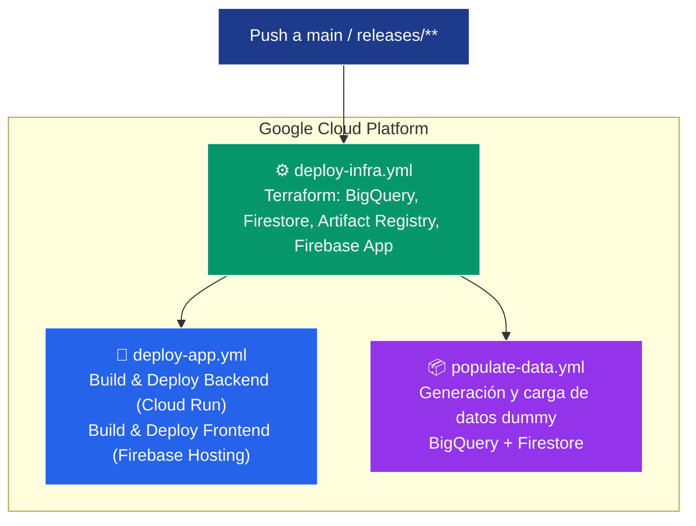
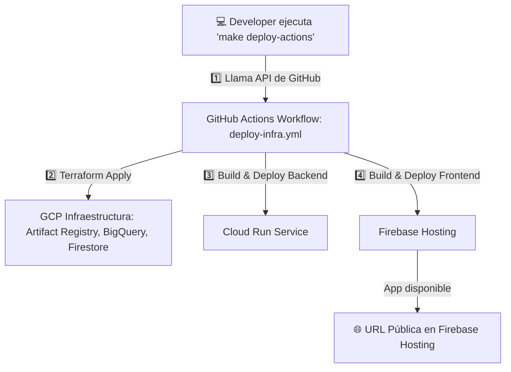

[](https://cloud.google.com)
[](https://peps.python.org/pep-0596/#schedule-first-bugfix-release)
[](https://react.dev/)
[](https://ai.google.dev/gemini-api/docs)
[](https://hub.docker.com/r/amazon/aws-lambda-python)
[](https://nodejs.org/)
[](gender_movie_classification/events/event.json)
[](https://hoppscotch.io/)


# Infraestructura - IaC: HackDay Gemini Assistant

Este módulo Terraform crea:
- Artifact Registry
- Cloud Run (backend)
- Firebase Hosting (frontend)

## Despliegue manual

```bash
cd terraform
terraform init
terraform apply -auto-approve -var="project_id=MI_PROYECTO" -var="credentials_file=../gcp-key.json"
```

## Destrucción

```bash
terraform destroy -auto-approve
```

## Local website

Para probar la parte del UI se tiene en el `frontend/src/package.json`

```json
{
    "name": "hackday-gemini-assistant",
    "version": "1.0.0",
    "private": true,
    "dependencies": {
        "html2canvas": "^1.4.1",
        "react": "^18.2.0",
        "react-dom": "^18.2.0",
        "react-feather": "^2.0.10",
        "react-scripts": "5.0.1"
    },
    "scripts": {
        "start": "react-scripts start",
        "build": "react-scripts build",
        "test": "react-scripts test",
        "eject": "react-scripts eject"
    },
    "eslintConfig": {
        "extends": [
            "react-app",
            "react-app/jest"
        ]
    },
    "browserslist": {
        "production": [
            ">0.2%",
            "not dead",
            "not op_mini all"
        ],
        "development": [
            "last 1 chrome version",
            "last 1 firefox version",
            "last 1 safari version"
        ]
    }
}
```

Dentro de `frontend` correr en la terminal el servidor local de node:

```bash
cd frontend
npm install
npm start
```


## Despliegue automático (CI/CD)
GitHub Actions ejecuta automáticamente:
1. Terraform para infraestructura.
2. Construcción de imagen y despliegue en Cloud Run.
3. Deploy frontend a Firebase Hosting.


## 🚀 Flujo de Despliegue Automático (GitHub Actions)



📌 Tabla de Comandos make ...-actions y su efecto en GCP
| **Comando Make**           | **Workflow llamado**          | **Acción ejecutada en GCP (remotamente)**                                                                 | **Cuándo usarlo**                                                                 |
|----------------------------|------------------------------|-----------------------------------------------------------------------------------------------------------|-----------------------------------------------------------------------------------|
| `make deploy-actions`      | `.github/workflows/deploy-infra.yml` | 🚀 Crea/actualiza la infraestructura con Terraform + despliega **backend (Cloud Run)** + **frontend (Firebase Hosting)** usando la rama actual. | Cuando quieres desplegar tu aplicación y la infraestructura en la nube sin correr nada localmente. Ideal para pruebas o despliegue manual. |
| `make populate-actions`    | `.github/workflows/populate-data.yml` | 📦 Genera datos dummy y los carga en **BigQuery** y **Firestore** (requiere infraestructura ya desplegada). | Después de un despliegue para poblar datos de prueba sin correr scripts locales.   |
| `make destroy-actions`     | `.github/workflows/destroy-infra.yml` | 🗑️ Elimina la infraestructura de GCP (Terraform destroy) + borra servicio de **Cloud Run** + elimina hosting en Firebase. | Cuando deseas eliminar toda la infraestructura y despliegues desde la nube sin usar tu terminal local. |


📌 Diagrama de Flujo (Mermaid)



## ⚙️ Configuración de GitHub Actions (Variables y Secrets)

Este archivo define qué variables y secrets necesitas configurar en el repositorio para habilitar el CI/CD en GCP con GitHub Actions.

1️⃣ Repository → Variables (no sensibles)

Estas son visibles para todos los colaboradores del repositorio, pero no contienen información sensible:

| **Nombre**       | **Ejemplo**              | **Uso en los workflows**                              |
| ---------------- | ------------------------ | ----------------------------------------------------- |
| `GCP_PROJECT_ID` | `hackday-project-1234`   | ID del proyecto GCP (`deploy`, `destroy`, `populate`) |
| `GCP_REGION`     | `us-central1`            | Región donde se despliega Cloud Run y Firebase        |
| `SERVICE_NAME`   | `hackday-gemini-backend` | Nombre del servicio en Cloud Run                      |
| `BACKEND_DIR`    | `backend`                | Carpeta backend para la build Docker                  |
| `FRONTEND_DIR`   | `frontend`               | Carpeta frontend para build Firebase                  |
| `TF_DIR`         | `terraform`              | Carpeta con configuración Terraform                   |


2️⃣ Repository → Secrets (privados y cifrados)

Estos contienen credenciales y datos sensibles, no visibles para los colaboradores.

| **Nombre**       | **Descripción**                                                                                                                                                       | **Cómo obtenerlo**                                                         |
| ---------------- | --------------------------------------------------------------------------------------------------------------------------------------------------------------------- | -------------------------------------------------------------------------- |
| `GCP_SA_KEY`     | Contenido del archivo JSON de la Service Account con permisos mínimos (`BigQuery Data Editor`, `Cloud Datastore User`, `Artifact Registry Reader`, `Cloud Run Admin`) | Google Cloud Console → IAM & Admin → Service Accounts → Keys → JSON        |
| `FIREBASE_TOKEN` | Token de autenticación para Firebase Hosting CI/CD                                                                                                                    | Ejecuta `firebase login:ci` en tu terminal local y copia el token generado |


3️⃣ Opcionales (solo si se requiere usar en scripts Python)

| **Nombre**         | **Ejemplo**           | **Uso**                             |
| ------------------ | --------------------- | ----------------------------------- |
| `BIGQUERY_DATASET` | `hackday_data`        | Dataset donde se cargan datos dummy |
| `BIGQUERY_TABLE`   | `gemini_interactions` | Tabla de destino en BigQuery        |

> ⚠️ Si no defines estas variables en GitHub, tus scripts usarán los valores por defecto (hackday_data, gemini_interactions) ya configurados en db.py y load_dummy_data.py.

4️⃣ Dónde configurarlos

    Ve a tu repositorio en GitHub.

    En la pestaña Settings → Secrets and variables → Actions:

        En Variables, añade los valores de la sección 1️⃣.

        En Secrets, añade los valores de la sección 2️⃣.

    Guarda los cambios.

5️⃣ Verificación

Ejecuta el siguiente comando para confirmar que los workflows ven correctamente las variables:

```bash
gh variable list
gh secret list
```