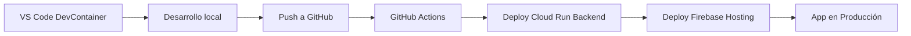

# HackDay Gemini Prototype

## 🎯 Objetivos
- Asesoría en tiempo real
- Simulación de compra
- Experiencia interactiva
- Análisis multimodal (voz + UI)

## 📌 Arquitectura
- **Frontend:** React (Firebase Hosting)
- **Backend:** FastAPI (Cloud Run Serverless)
- **Datos:** Firestore + BigQuery
- **Interacción:** WebSockets para baja latencia

## ✅ Métricas sugeridas para Looker Studio
- Interacciones por producto
- Etapas más consultadas
- Conversión de consultas a compra
- Tiempo medio de asistencia
